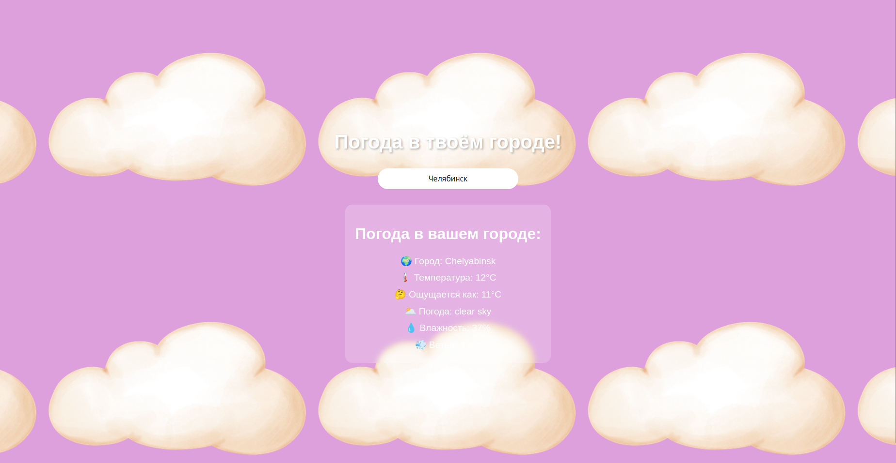

Weather App

Простое и удобное приложение для просмотра погоды в любом городе.  
Использует публичное API для получения актуальных данных.

Функционал

- Поиск погоды по названию города
- Отображение температуры, влажности, скорости ветра
- Иконка погоды (солнечно, облачно, дождь и т.д.)
- Обработка ошибок (город не найден)
- Адаптивный дизайн (работает на телефонах и компьютерах)

Технологии

- **JavaScript** (чистый, без фреймворков)
- **HTML5 / CSS3** (адаптивная вёрстка)
- **REST API** (OpenWeatherMap / WeatherAPI)

Скриншоты



Установка и запуск

```bash
# Клонируй репозиторий
git clone https://github.com/твой-ник/weather-app.git

# Перейди в папку проекта
cd weather-app

# Открой index.html в браузере
# Или используй Live Server в VS Code
